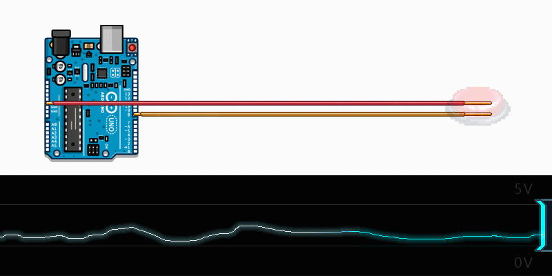

**Para fazer um aproveitamento total dos recursos interativos, acesse pelo computador :smile:**

# Introdução
Este artigo parte do princípio que você já começou a fazer alguns experimentos com Arduino.  
Se você não conhece nada sobre Arduino, dá uma olhada [neste material sensacional sobre o assunto no Manual do Mundo](https://youtu.be/sv9dDtYnE1g).


    <iframe width="100%" height="400" title="Sketchfab Viewer" class="c-viewer__iframe" src="https://sketchfab.com/models/de0a040ba21c4d9a82412e042edb904a/embed?autostart=1&amp;internal=1&amp;ui_infos=0&amp;ui_snapshots=1&amp;ui_stop=0&amp;ui_watermark=0" id="api-frame" allow="autoplay;fullscreen;vr" allowfullscreen="" frameborder="0"></iframe>

> Placa Arduino Uno. Clique sobre os números para ver o nome do componente.


# Botão
Imagine que eu tenho uma lâmpada ligada a uma bateria através de fios. Se eu cortar um desses fios, interrompendo a passagem de energia, consequentemente a lâmpada irá apagar.  
Se eu reconectar do fio rompido a lâmpada volta a acender.

O botão é um componente de acionamento mecânico que encosta o contato de fios quando pressionado, fechando o circuito e fazendo com que os elétrons possam atuar nos componentes envolvidos.

No exemplo a seguir temos um circuito elétrico representando uma fonte de energia, uma lâmpada e um botão.  
Clique sobre o botão para fechar o circuito e ver como ele se comporta:


    <iframe width="100%" height="400" src="https://lushprojects.com/circuitjs/circuitjs.html?cct=$+1+0.000005+10.20027730826997+50+5+50%0Aw+-176+64+-128+64+0%0As+-256+64+-176+64+0+1+false%0A162+-128+64+-16+64+2+default-led+1+0+0+0.01%0Av+-16+144+-256+144+0+0+40+5+0+0+0.5%0Aw+-256+64+-256+144+0%0Aw+-16+144+-16+64+0%0Ax+-246+28+-184+31+4+24+Bot%C3%A3o%0Ax+-127+27+-27+30+4+24+L%C3%A2mpada%0Ax+-219+191+-38+194+4+24+Fonte%5Csde%5Csenergia%0A" frameborder="0"></iframe>


# Arduino
Quando montamos um circuito com Arduino, o botão se mostra um componente muito útil, pois através dele podemos acionar as entradas digitais e fazer com que ao receber esta informação um comando de programação possa ser executado.  
O acionamento da porta digital de um Arduino Uno, por exemplo, é ligada ou desligada conforme recebe ZERO Volts ou 5 Volts, alterando seu nível lógico.  
  
* Botão pressionado, 5V na entrada digital: nível lógico Alto
* Botão solto, 0V (teórico) na entrada digital: nível lógico Baixo

*Além do botão, chaves, relés, transistores e outros componenetes podem acionar as entradas digitais utilizando o mesmo princípio.

# Estado flutuante
Até então expliquei como a coisa funciona na teoria, mas na verdade, quando o botão está solto o circuito fica aberto e eu não estou enviando realmente ZERO Volts, mas sim um valor flutuante.  
Isso porque o fio solto conetado a porta digital se comporta como uma antena e capta as interferências, enviando estes valores flutuantes para o Arduino.  
  
Tanto o próprio campo eletromagnético dos outros fios e componentes no circuito, quanto eletricidade estática e outros fatores podem ser captados por esse fio que se tornou uma antena indesejada.

No circuito abaixo segure o Botão para enviar 5 Volts pressionado por alguns instantes.. Observe que o Voltímetro não vai mostrar ZERO Volts com o Botão solto:

**Para funcionar, clique em Iniciar simulação:**

    <iframe width="100%" height="453" src="https://www.tinkercad.com/embed/lXHLrQseyzi?editbtn=1" frameborder="0" marginwidth="0" marginheight="0" scrolling="no"></iframe>

> Se preferir ajuste o Zoom com a roda do mouse

Como na vida real a mudança do nível lógico do Arduino não é exato, mas APROXIMADAMENTE 0 Volts e 5 Volts, pode ser que a mudança do nível lógico ALTO já aconteça com 3,5 Volts, por exemplo. Causando várias leituras erradas com essa flutuação.

# Curto Circuito
Quando existe uma conexão direta entre os polos da fonte, existe pouquíssima resistência a passagem dos elétrons causando um curto-circuito, ou seja uma sobrecarga nos componentes e fiações que podem causar problemas como rompimentos e incêndios.  
Então sempre que utilizamos um botão para fechar um circuito, precisamos ter uma resistência para que não ocorra o curto circuito.  
Esta resistência a passagem dos elétrons pode ser oferecida por um componente, como a lâmpada no circuito acima, ou um resistor, que nada mais é que um componente feito exatamente para oferecer resistência a passagem dos elétrons.  
Até o final você vai entender porque estou explicando isso. :smile:

# Resistores Pull-up
Por motivo de simplicidade, vamos nos focar neste tutorial em resistores de pull-up, pois eles são mais comuns que os resistores de pull-down. Eles operam usando os mesmos princípios, exceto que o resistor de pull-up é conectado a um nível alto de tensão (no nosso caso 5V), e o resistor de pull-down é conectado ao terra, ou nível baixo.  

Para termos um circuito sempre fechado e poder enviar ZERO Volts e 5 Volts pra valer, utilizamos o resistor de pull-up para nos ajudar.  
Observe que mesmo quando o botão está aberto, o circuito como um todo está sempre com o posistivo e negativo conectados e chegando a entrada do voltímetro. Sem antenas.

**Para funcionar, clique em Iniciar simulação:**

    <iframe width="100%" height="453" src="https://www.tinkercad.com/embed/baQQc3kwZ5v?editbtn=1" frameborder="0" marginwidth="0" marginheight="0" scrolling="no"></iframe>

> Se preferir ajuste o Zoom com a roda do mouse

Percebeu que agora o botão funciona ao contrário? Com ele aberto temos 5 Volts e com ele fechado temos ZERO Volts.  
Mas isso não tem problema algum, pois basta considerarmos isto no código fonte do programa na memória do Arduino.  

# Fluxo dos Elétrons
Observe o fluxo dos elétrons no exemplo a seguir. Eles sempre pegam o caminho com menor resistência.  
A entrada digital do Arduino (ou a lâmpada no exemplo abaixo) possui uma certa resistência, por isso os elétrons vão no sentido contrário a eles quando o botão está fechado.  

    <iframe width="100%" height="400" src="https://lushprojects.com/circuitjs/circuitjs.html?cct=$+1+0.000005+10.20027730826997+50+5+50%0Aw+-288+32+-240+32+0%0As+-288+192+-16+192+0+1+false%0A162+-240+32+-16+32+2+default-led+1+0+0+0.01%0Av+-16+112+-240+112+0+0+40+5+0+0+0.5%0Aw+-16+32+-16+112+0%0Ax+-184+226+-122+229+4+24+Bot%C3%A3o%0Ax+-177+8+-77+11+4+24+L%C3%A2mpada%0Ax+-207+147+-26+150+4+24+Fonte%5Csde%5Csenergia%0Ar+-240+32+-240+112+0+1000%0Aw+-288+32+-288+192+0%0Aw+-16+192+-16+112+0%0Ax+-283+20+-195+23+4+24+Resistor%0A" frameborder="0"></iframe>


# Conclusão
Mantendo o circuito com a fonte de energia sempre fechado, garantimos a chegada de ZERO e 5 Volts quando precisamos. Apenas direcionando os elétrons.  
Utilizando um resistor de pull-up fazemos isso sem causar um curto-circuito, pois independentemente do direcionamento do fluxo de elétrons, sempre haverá uma carga (resistência) no caminho de volta até a fonte.

## Dica final de ouro!
Prevendo tudo isso algumas placas (como o Arduino Uno) adicionaram resistores de pull-up diretamente em seus circuitos.  
Para habilitar basta inicializar o pino de entrada conforme a seguir:  
```cpp
//Supondo que seja o pino 8
pinMode(8, INPUT_PULLUP);
```
 E fazer a ligação do botão entre o pino de entrada digital e o GND:  
  


**Agora você realmente sabe como e porquê utilizamos o resistor de pull-up para entradas digitais no Arduino.**

# Referências
https://portal.vidadesilicio.com.br/entradas-e-saidas-digitais/  
https://www.embarcados.com.br/arduino-uno/  
https://www.embarcados.com.br/pinos-digitais-do-arduino/https://www.embarcados.com.br/pinos-digitais-do-arduino/  
http://www.bosontreinamentos.com.br/eletronica/curso-de-eletronica/eletronica-o-que-sao-resistores-de-pull-up/  
https://www.youtube.com/watch?v=85JBpY0lBaQ  
https://www.youtube.com/watch?v=CVJtWZqZ18I  
https://www.arduino.cc/en/Tutorial/InputPullupSerial
