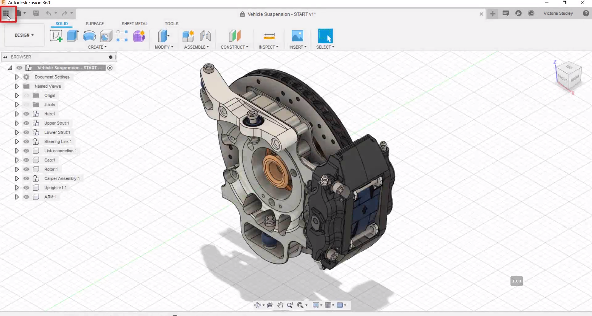
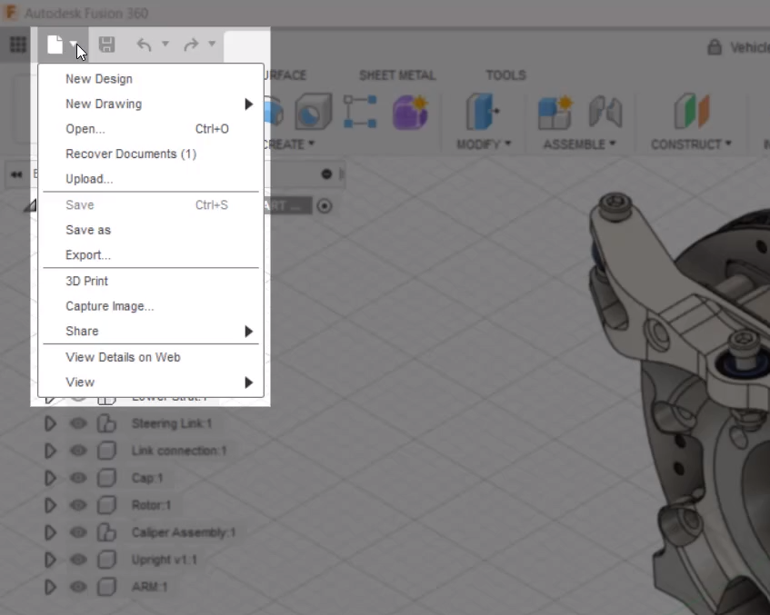
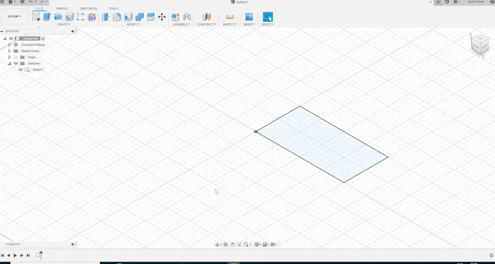

# Indrodução

Modelagem 3D é o processo que usa software para criar uma representação matemática de um objeto ou forma tridimensional. O objeto criado é chamado de modelo 3D e tais modelos são usados em vários setores como: Engenharia, medicina, cinema, videogames, arquitetura entre vários outros.

Nesse artigo vamos utilizar o Fusion 360 da Autodesk, um software moderno e versátil para demonstrar os princípios da modelagem 3D. Mas não se preocupe ele grátis para estudantes e para pessoas que queiram fazer projetos pessoais sem fins lucrativos. Outra grande vantagem do Fusion é ser baseado em nuvem o que permite trabalhar de modo colaborativo.

# Tipos de modelagem

Existem resumidamente 6 tipos de modelagem são eles

***FreeForm:*** Utilizada em designs orgânicos permite a criação de formas sem a necessidade de medidas específicas ou alguma relação direta com o restante do modelo.

***Parametric:*** Comumente utilizada para projeto de peças mecânicas essa técnica faz uso de medidas e outras relações (abordaremos futuramente) para construir o modelo desejado.

***Sheet metal:*** Tem seu uso restrito a modelagem de peças que serão fabricadas a partir de chapas metálicas ou demais materiais calculando a perda de material em dobras e curvaturas.

***Direct:*** Quando importamos um modelo dificilmente temos acesso ao histórico de alterações do mesmo onde normalmente buscaríamos o recuso para alterar. Com o modo direct você consegue fazer alterações mesmo sem esse histórico geométrico o que facilita muito. Mesmo em modelos paramétricos onde você tem referências e o histórico de modificações por vezes alterar pequenos detalhes pelo histórico acaba não sendo muito prático e é aí que o Direct facilita sua vida.

***Surface:*** Neste modo podemos criar ou eliminar superfícies, também pode ser muito útil ao criar formas orgânicas.

***Mesh:*** O modo Mesh basicamente trabalha a malha, modelos para impressão 3D geralmente são apenas uma malha e podem ser editados através desse modo.

Não se assuste, tudo leva seu tempo, você não precisa aprender como trabalhar em todos os modos logo de cara para modelar inicialmente.

# Criando o Modelo 3D

Vamos abordar o modo paramétrico e tenho certeza que você vai terminar este artigo sabendo criar seu modelo 3D ok? Mas Antes disso precisamos saber navegar pelo programa para chegarmos na fase de modelação concorda? Vamos lá então.

logo no primeiro ícone você tem acesso aos seus aquivos, projetos e modelos.

Já o segundo ícone é o menu de arquivos, aqui você pode criar, fazer upload, abrir, salvar, exportar e compartilhar arquivos.

Para criar um modelo 3D precisamos antes fazer um esboço em 2D, o famoso Sketch, ele que vai nos dar as referências.

Clique no ícone Create a Sketch na barra de ferramentas. Agora devemos escolher em que plano (X, Y ou Z) queremos fazer o desenho. Você pode criar um modelo a partir do plano que quiser mas para facilitar nossa visualização escolha o plano Z (a base)

Pronto! agora temos a visão 2D do plano e podemos fazer nosso esboço.

Agora selecione o retângulo na barra de ferramentas, vamos clicar na origem dos planos para travar o esboço na mesma e então desloque o cursor e clique novamente.

Para deixar esse retângulo no tamanho desejado utilizamos a ferramenta Sketch Dimension, com ela vamos clicar em uma das linhas e inserir uma medida (geralmente se trabalha com milímetros mas pode ser ajustado) nesse primeiramente 80mm e na outra linha 50mm. Mas e se eu mudar de ideia e quiser alterar a medida que acabei de adicionar? Sem problemas, clique duas vezes na medida e insira o novo valor.

Agora temos nosso esboço e podemos finalizar o sketch.

A partir dele vamos fazer uma extrusão (criar material) clicando em extrusão na barra de tarefas da secção SOLID, precisamos então indicar qual sketch queremos usar como referência para essa extrusão e inserir o tamanho da extrusão que queremos realizar.

Pronto, agora você acabou de fazer sua primeira modelagem 3D!

Para rotacionar a visualização basta segurar shift + botão de roda do mouse movendo o mesmo.

Assim como a extrusão existem inúmeras ferramentas para modelar como por exemplo a ferramenta de corte o Cut que ao invés de adicionar material corta ou remove o mesmo.

Repetimos o processo fazendo um novo sketch agora selecionando uma face do nosso sólido, podemos então desenhar apenas como exemplo um círculo, finalizamos o sketch e usando o ícone do Extrude, mudamos no seu menu ou apenas arrastando no sentido que queremos remover material

Pronto! Agora que você desmistificou como a modelagem 3D funciona pode fazer seus próprios modelos, comece com algo simples e vá aprimorando ao longo do caminho.