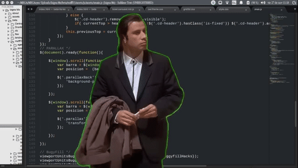
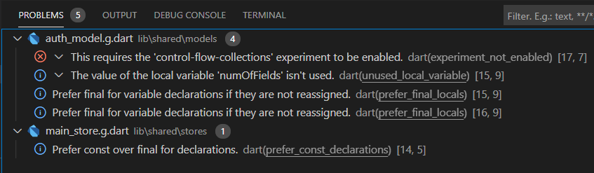

# Indrodução

Todo dia escrevemos um monte de linhas de código, que muitas vezes não passam por revisão e entram em ambiente produtivo sem garantia de qualidade. Não necessariamente esse código vai gerar bugs (pode gerar), porém, ele poderia ter sido escrito de uma melhor forma a fim de facilitar a leitura e manutenção por outros programadores. No fim das contas, regras existem para gerar ordem, e se tratando de código, todos gostamos de ler algo bem organizado e padronizado!

# O que é "Linting"?

De acordo com a resposta de Oded Coster no [Stack Overflow](https://stackoverflow.com/a/8503586), "**Linting** é o processo de execução de um programa que analisará o código buscando por possíveis erros".

O **Linter** é a ferramenta que analisa o código buscando por esses possíveis erros de programação, bugs e códigos de origem duvidosa :stuck_out_tongue_winking_eye:

# Alguns exemplos

Abaixo podemos ver alguns exemplos do que fazer (e não fazer) no nosso código.

|  |
|:--:| 
| *`import` desnecessário* |

Na imagem acima, o aviso no `import` mostra que o arquivo `url_launcher.dart` foi importado, porém nunca é usado. A solução para este caso é remover o `import` desnecessário, dessa forma o warning sumirá.

|  |
|:--:| 
| *prefira usar `ìf-null operators`* |

Na imagem acima o aviso é um pouco diferente, pois a condição ternária apresentada não está errada, só existe uma forma mais elegante de se escrever esse código, conforme a regra define. Você pode ler sobre essa regra especificamente neste [link](https://dart-lang.github.io/linter/lints/prefer_if_null_operators.html).

Agora vamos para parte interessante, onde configuraremos o Linter no seu projeto, pro seu colega de trabalho não abrir seu código e ter a seguinte reação:



# Configurando o Linter no seu projeto

Para projetos Flutter, o guia de regras utilizadas é o definido pela Google, através do [Effective Dart: Style](https://dart.dev/guides/language/effective-dart/style).
Eu particularmente gosto muito de utilizar o pacote [lint](https://pub.dev/packages/lint), que já vem com uma pré configuração de regras mais rigorosas.

O primeiro passo para a configuração é adicionar a dependencia `lint` no seu `pubspec.yml`
```
dev_dependencies:
  lint: ^1.2.0
```

Crie um arquivo `analysis_options.yaml` na raíz do seu projeto e importe as regras do pacote `lint`
```
include: package:lint/analysis_options.yaml
```

Pronto! Simples, né?  
Com esses passos feitos, você terá seu linter configurado, e caso esteja utilizando o VSCode, os avisos já aparecerão na aba de `problems` do VSCode.

# Como customizar as regras utilizadas pelo Linter?

Caso você esteja insatisfeito com alguma regra definida, ou queira adicionar alguma validação, é so alterar a estrutura do arquivo `analysis_options.yml` com as regras de sua preferência. Vale a pena checar a [lista de regras suportadas](https://dart-lang.github.io/linter/lints/).

Vou deixar abaixo uma configuração que normalmente uso em meus projetos, mas lembrando, não necessariamente você precise de todas, use somente as que realmente vão agregar em algo no seu projeto.


    <script src="https://gist.github.com/mawippel/d12654679b8514b5fbf7ef2d81285341.js"></script>


# (Extra) Dica caso você esteja usando MobX

Se você utiliza/já utilizou MobX em seus projetos, provavelmente já sofreu com a ação do linter nos arquivos gerados pelo próprio MobX, como na imagem abaixo:



As sugestões feitas pelo linter fazem todo o sentido, e realmente deveriam ser aplicadas, porém, o próprio MobX nos avisa para que não altere nenhum arquivo gerado na mão.  
Dessa forma, o melhor a se fazer é desabilitar o linting para esses arquivos gerados, e isso pode ser feito da seguinte forma:

No arquivo `analysis_options.yml` você deverá adicionar o seguinte trecho:
```
analyzer:
  exclude:
    - lib/generated/**
```
Um exemplo completo pode ser visto nesse [link](https://gist.github.com/mawippel/d12654679b8514b5fbf7ef2d81285341).

Além disso, para que o VSCode realmente ignore esses arquivos, é necessário adicionar a seguinte informação nas configurações do VSCode (`settings.json`):
```
"dart.analysisExcludedFolders": [
    "lib/**.g.dart"
],
```

Com essas alterações feitas, os arquivos gerados pelo MobX não serão considerados pelo Linter :smiley:
