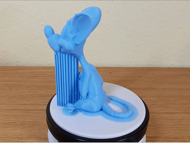
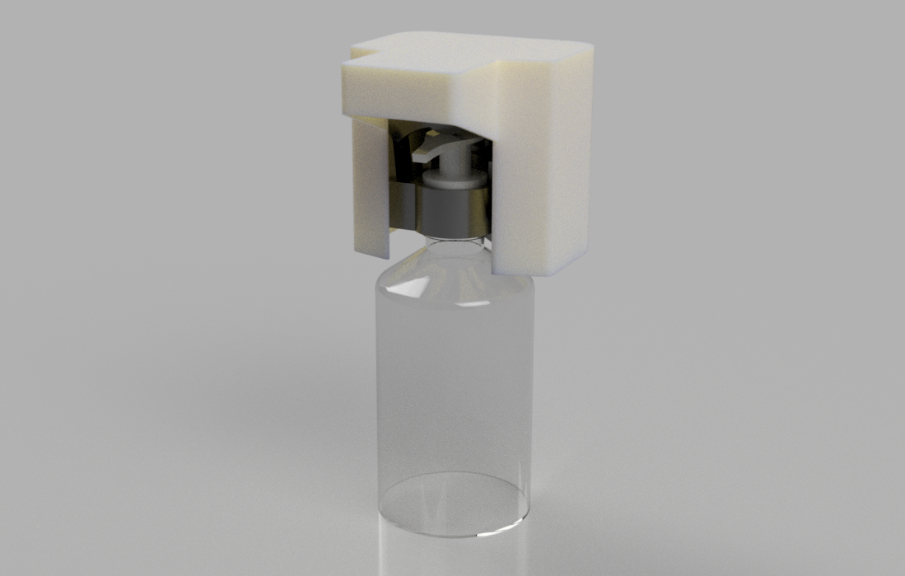
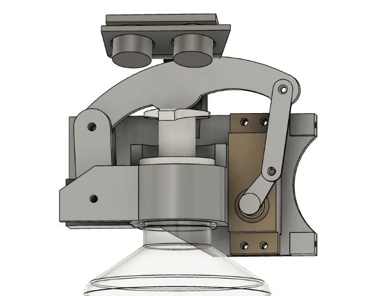
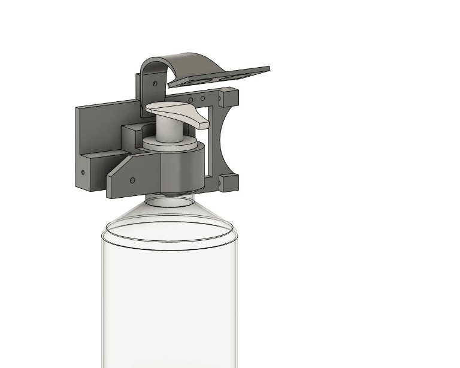
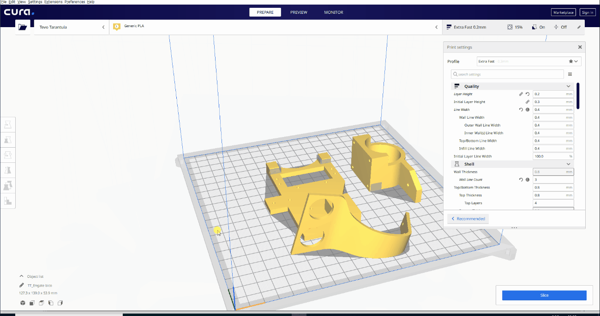

# Introdução

Existem diferentes formas de modelar um mesmo objeto em 3D porém quando se trata de tornar esse modelo algo palpável precisamos conhecer muito bem as capacidades e limitações da técnica de fabricação digital que iremos empregar caso contrário essa tarefa pode se tornar demorada, custosa e ineficiente.  Vamos primeiramente compreender o funcionamento da tecnologia e seguimos para um exemplo prático

# Impressão 3D FDM

A impressão FDM (Fused Deposition Modeling) é uma das técnicas impressão mais amplamente utilizadas para fabricação de protótipos e peças funcionais. O processo é baseado na extrusão de polímero através de um bico aquecido, o material é depositado em uma plataforma formando a camada inicial que serve de base para a deposição das demais camadas acima. Todo o processo funciona através de coordenadas e comandos gerados por um software específico para esta tarefa. A simplicidade, confiabilidade e custo da impressão FDM tornou esta tecnologia amplamente adotada e reconhecida no meio industrial, acadêmico e até mesmo comercial.  Sua grande vantagem está na eficiência e flexibilidade de produção, enquanto outras tecnologias levariam meses para materializar uma prova de conceito a impressão 3d é capaz de realizar esta tarefa em algumas horas. Outra grande vantagem é a possibilidade de realizar rápidas alterações aos modelos e em uma mesma máquina, inclusive ao mesmo tempo imprimir diferentes objetos. Seu uso em departamentos de P&D tornou-se indispensável devido ao volume de testes e alterações que rotineiramente acontecem ao desenvolver um novo produto.

# Boas práticas para fabricação FDM

Como a impressão FDM é feita em camadas e o material depositado através de um bico que geralmente tem diâmetro inferior a 1mm, a resistência dessa peça pode ser diferente de um local para o outro dependendo da orientação da peça no momento da impressão. Um fator característico dessa tecnologia é que as peças são mais resistentes a tração no sentido XY (horizontal) do que no sentido Z (vertical), isto acontece porque a impressora quando realiza uma camada está na maior parte do tempo extrudando o polímero em fluxo contínuo, o material dessa camada sofre poucas emendas. Quando uma nova camada é depositada ela é extrudada em cima da anterior, porém se trata de uma nova deposição, a junção das camadas se dá exclusivamente pela fusão do material aquecido quando depositado. 

Outra característica decorrente deste método é que quando imprimimos um objeto, digamos um retângulo na vertical, ele leva mais tempo para ser impresso do que o mesmo quando colocado na horizontal. Isso ocorre pois a cada nova camada a impressora precisa "aguardar" enquanto movimenta seu eixo Z e se prepara para iniciar a nova camada.

O material extrudado precisa de uma base para se depositar, quando o modelo tem alguma saliência como no exemplo abaixo é necessário o uso de material de suporte que é posteriormente removido. Vale lembrar que os suportes adicionam tempo de fabricação e aumentam o desperdício de matéria prima no processo.

  Se existir algum vão entre dois pontos na impressão ainda é possível utilizar um recurso chamado de Bridging que altera fatores como velocidade, extrusão e temperatura para garantir que o material ligue os pontos de forma uniforme sem a necessidade de suportes. Abaixo também é possível observar que é possível imprimir com certa inclinação, mas existem limites dependendo do material, temperatura, ventilação e velocidade para isso, ultrapassando o limite de inclinação também se faz necessário o uso de suportes.

# Exemplo prático - Dispenser de álcool gel

Para demonstrar a importância dos conceitos acima realizei o projeto de um dispenser de álcool gel automático, no projeto basicamente possui um sensor ultrassônico que aciona um servo motor conectado a uma alavanca de força pressionando o dosador. O intuito do projeto ao fazer um sistema de acionamento basicamente mecânico foi justamente demonstrar a importância de produzir peças robustas utilizando a orientação de impressão ideal para este caso.  

A extrutura de suporte do dispositivo e componentes foi projetada em 3 peças diferentes conforme imagem abaixo, uma **base** que é acoplada ao bocal do reservatório, uma **placa** que suporta o servo motor bem como a base da alavanca e o **suporte** do sensor ultrassônico. As peças será unidas posteriormente utilizando parafusos.\
Com esse projeto podemos imprimir as peças separadas cada uma com sua orientação ideal, com isso temos peças mais resistentes com menor tempo de produção, manos matéria prima e com menos desperdício. 

# Diferença no tempo de impressão

Vamos simular o tempo de impressão dos dois modelos para que possamos ver o tempo de impressão de cada um bem como a quantidade de matéria prima necessária para fabricação. 

Para esta simulação utilizei o software de fatiamento **Cura** que é free e está configurado para uso de uma impressora Tevo tarantula.

**Parâmetros utilizados:**

\
Velocidade: 60mm/s

Preenchimentol: 15%

Altura de camada: 0.20mm

.

### Simulação 1: Extrutura de suporte modelada em peça única:

Tempo de impressão elevado, grande quantidade de material de suporte e baixa resistência mecânica.

Tempo de impressão: 7h 42min

Matéria prima: 116g 

.

.

#### Simulação 2: Extrutura de suporte modelada em peças separadas:

Tempo de impressão reduzido em 59%,  matéria prima reduzida em 75%  utilizando pouco material de suporte e alta resistência mecânica.

Tempo de impressão: 3h 9min

Matéria prima: 40g 

